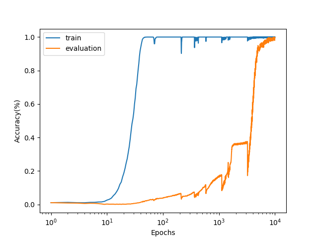

# Subtask 1
对文章中的结果进行了复现，发现在50epoch左右的时候train accuracy就已经达到1.00，但test accuracy经历了一段相当长时间的过拟合，直到10000epoch左右的时候才上升到1.00附近，出现典型的grokking现象，如下图所示.

值得注意的是，如果使用PyTorch内置的Transformer模型nn.TransformerEncoderLayer进行实验，则会发现test accuracy上升的速度相当快，与正常训练的表现类似. 
