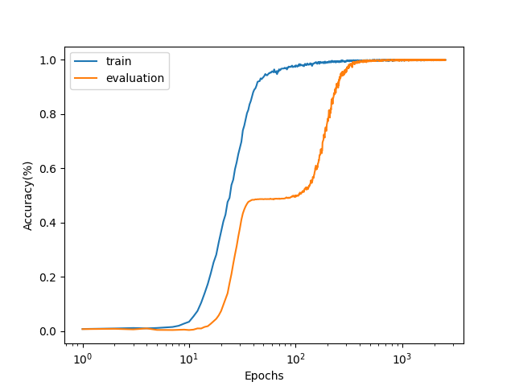

# Subtask 1
### Exp 1
对文章中的结果进行了复现，发现在50epoch左右的时候train accuracy就已经达到1.00，但eval accuracy经历了一段相当长时间的过拟合，直到10000epoch左右的时候才上升到1.00附近，出现典型的grokking现象，如下图所示.

### Exp 2
改变$\alpha$的值，发现对越小的$\alpha$，grokking现象越明显，即eval accuracy需要更长的时间才会有明显上升，如下图所示.

# Subtask 2
### Exp 1
使用共三层，形状为512->512->256->128的MLP进行实验，其余条件不变，同样出现grokking现象，如下图所示.

### Exp 2
使用两层128宽的LSTM进行实验，为加速收敛将batch size设为256，其他条件不变，同样出现grokking现象，如下图所示.

### Exp 3 (不一定要用)
使用Pytorch内置的TransformerEncoder进行实验，规模及其余条件与自己实现的Transformer一致，但是收敛速度要快许多，训练曲线的形态也有很大不同，如下图所示. 
